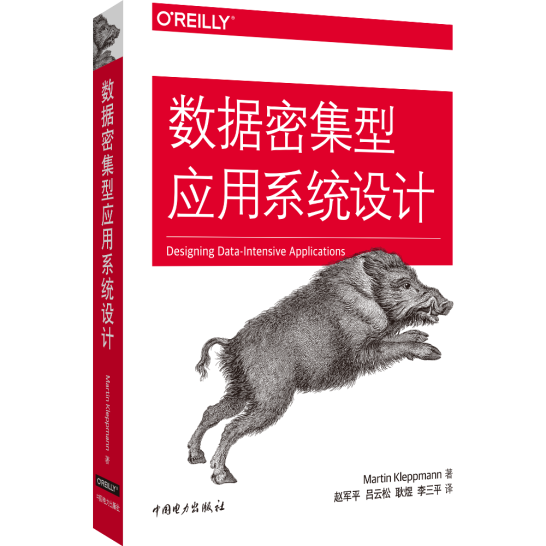

## MIT 6.824: Distributed Systems（分布式系统）
> 6.824是MIT开设的一门介绍分布式系统抽象与实现的课程，课程的主题包括容错、复制和一致性。课程的内容包括：Golang语言学习、分布式系统研究、一致性协议算法、著名分布式系统相关论文的讲解等。
>
> 6.824需要有一定的基础，先修课程是[MIT6.004(Computation Structures)](https://ocw.mit.edu/courses/electrical-engineering-and-computer-science/6-004-computation-structures-spring-2017/)、[MIT6.033(Computer System Engineering)](http://web.mit.edu/6.033/www/)或[MIT6.828(Operating System Engineering)](https://pdos.csail.mit.edu/6.828/2021/)，即需要对操作系统、计算机网络、计算机结构有一定的了解。

- [MIT 6.824: Distributed Systems（分布式系统）](#mit-6824--distributed-systems-------)
  * [0. 课程说明](#0-----)
  * [1. 课程安排（2021春）](#1--课程安排（2021春）)
  * [2. 相关论文](#2-----)
  * [3. 课程笔记](#3-----)
  * [4. 课程实验](#4-----)

### 0. 课程说明

- 课程主页：https://pdos.csail.mit.edu/6.824/

- 课程安排：https://pdos.csail.mit.edu/6.824/schedule.html

- 课程参考书可以使用：[<<数据密集型应用系统设计>>](https://book.douban.com/subject/30329536/)，该书将理论结构化，有着清晰的脉络。
  - 英文PDF下载链接：https://pan.baidu.com/s/1jJhzSxS5wd7HJyww7Z2m0w 密码：gjrn
  - 中文PDF下载链接：https://pan.baidu.com/s/1haKAkt_JqIMdhW06IGqvuA 密码：h5up
  - 中文非官方翻译链接：https://github.com/Vonng/ddia

### 1. 课程安排（2021春）

| 课程                                                         | 预习                                          | 资料                                                         |
| :----------------------------------------------------------- | :-------------------------------------------- | :----------------------------------------------------------- |
| **LEC 1:** [Introduction](https://pdos.csail.mit.edu/6.824/notes/l01.txt) | [MapReduce](./_Papers/MapReduce.pdf)          |                                                              |
| **LEC 2:** [RPC and Threads](https://pdos.csail.mit.edu/6.824/notes/l-rpc.txt) | [Online Go tutorial](http://tour.golang.org/) | [crawler.go](https://pdos.csail.mit.edu/6.824/notes/crawler.go), [kv.go](https://pdos.csail.mit.edu/6.824/notes/kv.go), [vote examples](./_Lectures/condvar.tar.gz) |
| **LEC 3:** [GFS](https://pdos.csail.mit.edu/6.824/notes/l-gfs.txt) |                                               |                                                              |
| **LEC 4:** [Primary-Backup Replication](https://pdos.csail.mit.edu/6.824/notes/l-vm-ft.txt) |                                               |                                                              |
| **LEC 5:** [Fault Tolerance: Raft (1)](https://pdos.csail.mit.edu/6.824/notes/l-raft.txt) |                                               |                                                              |
| **LEC 6:** [Q&A Lab 1](https://pdos.csail.mit.edu/6.824/notes/mr_solution_lecture.pdf) |                                               |                                                              |
| **LEC 7:** [Fault Tolerance: Raft (2)](https://pdos.csail.mit.edu/6.824/notes/l-raft2.txt) |                                               |                                                              |
| **LEC 8:** Q&A Lab2 A+B                                      |                                               |                                                              |
| **LEC 9:** [Zookeeper](https://pdos.csail.mit.edu/6.824/notes/l-zookeeper.txt) |                                               |                                                              |
| **LEC 10:** [Guest lecturer on Go](https://swtch.com/mit-6824-go-2021.pdf) |                                               |                                                              |
| **LEC 11:** [Chain Replication](https://pdos.csail.mit.edu/6.824/notes/l-cr.txt) |                                               |                                                              |
| **LEC 12:** [Cache Consistency: Frangipani](https://pdos.csail.mit.edu/6.824/notes/l-frangipani.txt) |                                               |                                                              |
| **LEC 13:** [Distributed Transactions](https://pdos.csail.mit.edu/6.824/notes/l-2pc.txt) |                                               |                                                              |
| **LEC 14:** [Spanner](https://pdos.csail.mit.edu/6.824/notes/l-spanner.txt) |                                               |                                                              |
| **LEC 15:** [Optimistic Concurrency Control](https://pdos.csail.mit.edu/6.824/notes/l-farm.txt) |                                               |                                                              |
| **LEC 16:** [Big Data: Spark](https://pdos.csail.mit.edu/6.824/notes/l-spark.txt) |                                               |                                                              |
| **LEC 17:** [Cache Consistency: Memcached at Facebook](https://pdos.csail.mit.edu/6.824/notes/l-memcached.txt) |                                               |                                                              |
| **LEC 18:** [Fork Consistency, SUNDR](https://pdos.csail.mit.edu/6.824/notes/l-sundr.txt) |                                               |                                                              |
| **LEC 19:** Peer-to-peer: [Bitcoin](https://pdos.csail.mit.edu/6.824/notes/l-bitcoin.txt) |                                               |                                                              |
| **LEC 20:** [Blockstack](https://pdos.csail.mit.edu/6.824/notes/l-blockstack.txt) |                                               |                                                              |
| **LEC 21:** Project demos                                    |                                               |                                                              |

### 2. 相关论文

|      | 论文标题                        |                            论文                             | 6.824课程  |
| :--: | ------------------------------- | :---------------------------------------------------------: | ---------- |
|  1   | MapReduce                       |          [英文版](./_Papers/MapReduce.pdf) 中文版           | LEC1       |
|  2   | The Google File System          |             [英文版](./_Papers/GFS.pdf) 中文版              | LEC3       |
|  3   | Fault-Tolerant Virtual Machines | [英文版](./_Papers/FaultTolerantVirtualMachines.pdf) 中文版 | LEC4       |
|  4   | Raft (Extended Version)         |        [英文版](./_Papers/Raft(Extended).pdf) 中文版        | LEC5, LEC7 |
|  5   | ZooKeeper                       |          [英文版](./_Papers/ZooKeeper.pdf) 中文版           | LEC9       |
|  6   | Chain Replication               |              [英文版](./_Papers/CR.pdf) 中文版              | LEC11      |
|  7   | Frangipani                      |          [英文版](./_Papers/Frangipani.pdf) 中文版          | LEC12      |
|  8   | Spanner                         |           [英文版](./_Papers/Spanner.pdf) 中文版            | LEC14      |
|  9   | FaRM                            |             [英文版](./_Papers/FaRM.pdf) 中文版             | LEC15      |
|  10  | Spark                           |            [英文版](./_Papers/Spark.pdf) 中文版             | LEC16      |
|  11  | Scaling Memcache at Facebook    |  [英文版](./_Papers/ScalingMemcacheAtFacebook.pdf) 中文版   | LEC17      |
|  12  | SUNDR                           |            [英文版](./_Papers/SUNDR.pdf) 中文版             | LEC18      |
|  13  | Bitcoin                         |           [英文版](./_Papers/Bitcoin.pdf) 中文版            | LEC19      |
|  14  | BlockStack                      |          [英文版](./_Papers/BlockStack.pdf) 中文版          | LEC20      |
|  15  | AnalogicFS experiences          |          [英文版](./_Papers/AnalogicFS.pdf) 中文版          | LEC21      |

### 3. 课程笔记

### 4. 课程实验

